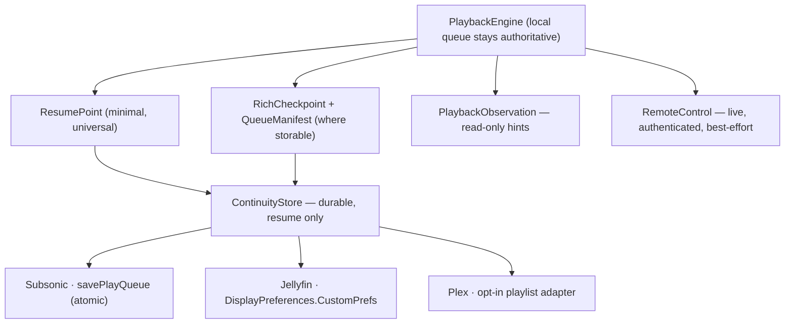

# ADR-0010 — Cross-device playback continuity (session handoff)

Status: **Proposed** (third draft; revised after source-level verification of all
three backends and two adversarial design reviews).

## Context

The ask, from a r/selfhosted thread on what self-hosted music is missing versus
Spotify:

> if you're playing a track on one device and open Spotify on a second device, it
> will usually ask if you want to listen on the new device. If you say yes, it
> seamlessly ends the playback on the first device and starts it on the second
> one. […] Basically, you can only have a single playback session going on in
> Spotify, and you can very easily move that session between devices.

Four capabilities with very different requirements:

| # | Capability | Needs | Latency tolerance |
| --- | --- | --- | --- |
| C1 | "Continue here" — open on device B, resume where A was | durable state | seconds |
| C2 | Live progress mirroring | live channel | none |
| C3 | Device picker — push playback to another device | live channel + target awake | none |
| C4 | Single-session — A stops when B takes over | atomic ownership | seconds |

The maintainer's target scenario is explicitly **off-network**: listening on
cellular away from home, then coming home and booting a **PC**, which should know
what was playing. Pure-offline listening is out of scope until reconnect.

That rules out iCloud (CloudKit / KV store / synced Keychain) for durable state: it
is Apple-only, so a PC can never read it, and the entitlement cannot be provisioned
headlessly — which would break the per-branch headless deploy flow exactly as App
Groups did (`AGENTS.local.md`). Durable state must live on the user's own server.

### What Mozz already has

- `PlaybackEngine.persistentState` → `PlaybackPersistentState { queue, elapsed }`
  with `restore(_:)`.
- Playback already reported to every backend (Jellyfin `Sessions/Playing…`, Plex
  `/:/timeline`, Subsonic `scrobble`).
- `ServerCapabilities` / `CapabilityResolver` — per-server feature gating.
- `NSLocalNetworkUsageDescription` + `NSBonjourServices` in `project.yml`;
  `LocalNetworkPermission` handles the iOS permission race.
- `clientIdentifier` — a stable, per-install, device-local id each server already
  uses to tell devices apart.

## Findings that constrain the design

All verified against upstream source, not documentation.

### No supported server persists a resume position for music

| Server | Evidence | Position stored? |
| --- | --- | --- |
| **Jellyfin** | `Audio` never overrides `SupportsPositionTicksResume`, inheriting `BaseItem`'s `=> false`; `UserDataManager.UpdatePlayState` then runs `if (!item.SupportsPositionTicksResume) { positionTicks = 0; }` before writing | **No — always 0** |
| **Plex** | `viewOffset` absent from `Track` records in `/status/sessions/history/all`; present only in live `/status/sessions`. "Store Track Progress" reported broken for audio (`plexinc/plex-media-player#738`) | **No** |
| **Subsonic** | `scrobble` has no position parameter in the protocol | **No** |

An earlier draft proposed a "universal floor" recovering position from play
history. It is dead. Two further defects sink it even for identifying the *track*:
"most recently played" means most recently **scrobbled/completed**, which is not
the track that was playing when playback stopped; and the account is shared with
every other client the user runs, so the latest activity may not be Mozz's.

**Mozz must write its own checkpoint.** Play history is a low-confidence hint only.

### Other decisive negatives

- **Jellyfin `NowPlayingQueue` is in-memory only** (a `ConcurrentDictionary` in
  `SessionManager`), lost on disconnect or restart.
- **Plex play queues are ephemeral and client-scoped**; `own=1` *transfers
  ownership* rather than passively reading. The earlier claim that Plex could offer
  durable full-queue storage via `/playQueues` is **withdrawn**.
- **A suspended iOS app cannot be a cast target.** iOS tears down `NWListener` and
  its Bonjour advertisement at suspension, with no socket-wake for third-party
  apps. Spotify's own iOS app behaves identically. Waking a cold device needs APNs,
  i.e. a provider server the user must run and pay for — cut on cost grounds.
- **Shuffle cannot be reconstructed from a seed.** `PlayQueue.balancedOrder` uses a
  *balanced* shuffle keyed on artist then album, biased per track by **recency and
  taste scores** — device-local personalized data. Two devices will not agree. The
  realized order must be transmitted verbatim.
- **No substrate offers compare-and-swap.** No ETags, no atomic append. Strict
  single-session ownership is therefore impossible without extra infrastructure.

## Decision

### 0. The governing rule

**Durable state carries resume information only — never ownership.** A device is
never stopped, and never yields, because of something it read from a durable store.
Stopping happens only over a live, authenticated channel. This single rule removes
the entire class of failures where a stale or clock-skewed write causes the device
the user just chose to stop unexpectedly.

Consequently **C4 is explicitly not guaranteed** and is not presented to the user
as "single session". It is best-effort live transfer.



### 1. Contracts: minimal core, optional richness

The adapters genuinely differ in what they can hold, so the common contract is only
what *every* writable store can represent. Subsonic cannot store a device, a
playback state, or a manifest revision; forcing it to implement a fat protocol
would mean inventing values.

```swift
/// The universal contract. Everything else is optional.
public struct ResumePoint: Codable, Sendable {
    public var current: TrackLocator
    public var positionSeconds: TimeInterval
    public var observedAt: Date?
}

public protocol ContinuityStore: Sendable {
    func loadResumePoint() async throws -> ResumePoint?
    func save(_ point: ResumePoint, rich: RichCheckpoint?, manifest: QueueManifest?) async throws
    var supports: ContinuityFeatures { get }   // richCheckpoint, manifest, presence
}
```

`RichCheckpoint`, `QueueManifest` and `PresenceLease` are optional components,
persisted only where a free-form store exists. `PlaybackObservation` (read-only
hints) and `RemoteControl` (live commands) stay separate protocols — combining
durable, observational and control concerns behind capability flags is what made
the previous draft dishonest.

### 2. Sessions identify, they do not arbitrate

Timestamps conflate *freshness* with *authority*: a routine progress heartbeat is
not a takeover, yet a later `capturedAt` would let an old device silently reclaim
the session. The fix is **not** an incrementing epoch — a counter is still a claim
to authority, two devices can mint the same next value, and "newer" is undefined
without CAS or trustworthy clocks.

So a session is an **opaque UUID that identifies a run of playback, and confers
nothing**:

| Field | Meaning |
| --- | --- |
| `sessionID` | Opaque UUID, minted on an explicit new playback or takeover. Not ordered, not comparable |
| `deviceID` | Which device produced this checkpoint |
| `cursorSequence` | Monotonic **within one `sessionID`**; orders that session's own updates and nothing else |
| `capturedAt` | Freshness / position extrapolation only — never authority |

Rules that follow, and that must not be violated:

- **An active publisher is never suppressed** by anything read from a durable
  store. A device that is playing keeps publishing, full stop.
- Rich stores keep **per-device checkpoints** rather than one contested slot, so
  device B arriving can be offered *competing resume candidates* ("iPhone, 2 min
  ago · Mac, yesterday") instead of a single winner chosen by clock skew.
- An outbox entry is discarded only when superseded by a **local** session
  transition or an **authenticated live handoff** — never by a remote timestamp.
- Subsonic has a single per-user queue and therefore is inherently
  **last-writer-wins**, with no durable ownership semantics at all. Accepted, not
  papered over.

`PresenceLease` (~60 s) gates "is something playing right now": without it a crashed
device leaves `playing` set forever. Position is extrapolated only inside the lease
and capped by track duration; the receiving device never autoplays.

`RichCheckpoint`, stored only where a free-form store exists, must bind the cursor
to a *queue occurrence* — `ResumePoint.current` alone cannot distinguish two plays
of the same track in one queue:

```swift
public struct RichCheckpoint: Codable, Sendable {
    public var sessionID: UUID
    public var deviceID: String
    public var cursorSequence: UInt64
    public var capturedAt: Date
    public var state: PlaybackState
    public var manifestID: String
    public var currentAbsoluteIndex: Int      // resolves duplicate occurrences
    public var positionMilliseconds: Int64    // integer: floats are not canonical
}
```

Classic Subsonic identifies `current` by **track id**, so a queue containing the
same track twice cannot resolve which occurrence is playing; only the index-based
extension can. Where duplicates exist on a classic server, queue-occurrence
fidelity is explicitly downgraded — track and position stay exact.

### 3. Manifests are immutable and content-addressed

A `manifestRevision: Int` pointing across two independently-written objects tears:
write manifest 8 over the sole slot, and a peer reading checkpoint 7 finds manifest
7 gone. Reversing the order fails the other way, and two devices can both mint a
different "8".

So: `manifestID = SHA256(canonicalManifestBytes)`. Write and verify the manifest
first, then the checkpoint that references it.

**Canonical encoding must be specified or this is not portable.** `JSONEncoder`
output is not canonical across platforms, and a PC peer has to compute the same
hash. Therefore: **RFC 8785 canonical JSON** (or canonical CBOR), all times and
positions as **integer milliseconds** — never floating point — and `manifestID`
itself excluded from the bytes it hashes.

**Retention must be explicit**, because versioned Jellyfin preference ids
accumulate and the API offers no convenient enumeration of abandoned ones. Each
checkpoint carries a bounded list of retained manifest ids forming a predecessor
chain; anything off the chain is collectable. Crash-orphaned manifests are accepted
as a known cost and swept periodically.

Backend notes:

- **Jellyfin** — separate/versioned display-preference ids, not two keys mutated
  through one whole-record POST.
- **Subsonic** — the split cannot exist physically: `savePlayQueue` atomically
  replaces queue *and* cursor together. That is a **benefit** (no tearing), at the
  cost that every cursor update resends the window.
- **Plex playlist (opt-in)** — items and `summary` are separate, non-atomic
  mutations, so it has the tearing problem and needs the same content-addressing.

### 4. The queue window is a fixed segment

A window defined as "current ± N" changes on every track, contradicting the claim
that manifests are written only on queue mutation. Instead the manifest is a fixed
segment, the cursor moves *within* it, and a new manifest is minted only near an
edge:

```swift
public struct QueueManifest: Codable, Sendable {
    public var manifestID: String            // SHA256 of canonical bytes
    public var descriptor: QueueDescriptor   // source kind + id + source revision/hash
    public var items: [ManifestItem]         // realized playback order, verbatim
    public var windowStartAbsoluteIndex: Int
    public var totalCount: Int
    public var hasMoreBefore: Bool
    public var hasMoreAfter: Bool
    public var repeatMode: ContinuityRepeatMode   // local enum, NOT MozzPlayback's
    public var isShuffled: Bool
}

public struct ManifestItem: Codable, Sendable {
    public var locator: TrackLocator
    public var baseOrdinal: Int    // index in the pre-shuffle base order
    public var title: String       // compact metadata so an unsynced device can render
    public var artist: String
    public var durationSeconds: TimeInterval
    public var artwork: ArtworkRef?
}
```

`baseOrdinal` is what makes turning shuffle **off** on the receiving device restore
the original order — impossible with a flat list plus an `isShuffled` flag. Beyond
a windowed queue's retained boundary, Previous/scroll is explicitly disabled rather
than pretending the source can always be reconstructed.

**Station queues do not transfer.** `continueAsStation` holds a runtime closure
(`onQueueNearEnd`) which is not serializable; a station transfers as its descriptor
and resumes generation locally, or as a plain queue.

### 5. Identity

`TrackLocator` is qualified by a **`ServerAccountFingerprint`** — server identity
*and* account identity (Jellyfin server `Id` + user id; Plex `machineIdentifier` +
account id). Today `AppEnvironment.serverId` is `"\(kind)-\(baseURL)"`, so the same
server reached at `http://192.168.1.5:8096` and `https://music.example.com`
produces two different ids, silently breaking correlation.

Generic Subsonic has **no protocol-level server UUID**, and `username@host` inherits
the same URL-dependence. So Subsonic continuity is scoped to the configured account
on that profile, with no claim of automatic cross-URL correlation; LAN peer transfer
there requires a user-confirmed alias mapping.

`deviceID` is a domain-separated hash of the existing `clientIdentifier`, not a new
identifier.

**Hydration.** `PlaybackEngine.restore` needs hydrated `Track`s, which a
freshly-installed PC will not have. Each backend must expose `resolveTrack(locator:)`,
and `ManifestItem` embeds compact metadata so the receiving device can render and
extrapolate (duration caps position) before resolution completes. Deleted or
unauthorized tracks are skipped, not fatal. Mixed-server queues are **unsupported**;
if the receiving device lacks credentials for the source it offers "connect to
server" rather than a broken restore. Downloaded files themselves never transfer.

### 6. Store adapters

| Backend | Mechanism | Verified properties | Tier |
| --- | --- | --- | --- |
| **Subsonic** | `savePlayQueue` / `getPlayQueue` | Per-user, atomic replace, no expiry, no storage cap. `position` in **ms**; `current` is a **track-id string**. Navidrome, gonic and LMS all implement it | Exact resume |
| **Jellyfin** | JSON in `DisplayPreferences.CustomPrefs` | `Value` has **no `MaxLength`** — unlimited TEXT. Non-GUID `displayPreferencesId` is deterministically MD5-hashed, so a stable string key works. `Client` capped at 32 chars | Exact resume + rich |
| **Plex** | Live observation + history hint; opt-in playlist adapter | No client-writable KV store; play queues ephemeral | Hint (exact while live) |

**Subsonic caveats, all verified:** `changedBy` is the `c=` client-name parameter —
not a device — so two Mozz installs are indistinguishable unless `c` varies per
device (Mozz currently sends a constant `clientInfo.product`); LMS hardcodes it to
`""`. gonic returns error 10 for an empty-`id` save, so "clear" must not be
expressed that way. Navidrome ≥ 0.57.0 prefers the `indexBasedQueue` extension,
which handles duplicate tracks correctly over the same underlying row. The window
must be capped by **encoded request size** (target < ~6 KiB of repeated `id=`
params), not item count, since ids vary in length — and because `savePlayQueue`
cannot update position alone, each cursor write resends that window.

**The Subsonic payoff is real:** Feishin implements these endpoints behind its
`SERVER_PLAY_QUEUE` flag, so a queue Mozz saves from the phone is genuinely loadable
by Feishin on a PC — the maintainer's exact scenario, with no Mozz-specific software
on the PC.

### 7. Plex

Default to **live exactness plus durable hinting**, and do not silently create
anything in the user's library:

1. While the source device or session is live — authenticated LAN peer, or
   `/status/sessions` as an observation source — take the exact track and position.
   This covers the phone-still-playing arrival-home case precisely.
2. Once the source disappears, fall back to the history hint (track only).
3. A durable playlist adapter (`Mozz — Continue Listening`, cursor JSON in the
   editable `summary`) is offered **only as explicit opt-in**, because playlist
   items and summary are non-atomic, other clients and the user can edit or delete
   it, and it leaves permanent application bookkeeping in a music library.

Playlist mutation stays **inside the Plex adapter**. Generic playlist writes are
*not* added to `MusicBackend`, which is deliberately read-only for playlists today.

### 8. Live layer

Scoped honestly to **devices currently running Mozz**. iOS advertises only while
alive (background `audio` keeps `NWListener` up indefinitely; suspension kills it).
macOS does not suspend, so a Mac is a reliable always-on peer. `_mozz._tcp` must be
in `NSBonjourServices` for **advertising** as well as browsing — omitting it fails
specifically on TestFlight/App Store builds.

Security is mandatory, and "a code/QR-derived key" is a requirement, not a design —
a short code plus an ordinary KDF is offline-brute-forceable. The LAN phase is
therefore **gated on a separate security ADR** specifying one of:

- a **high-entropy secret transported by QR**, or
- a reviewed **PAKE (e.g. SPAKE2)** if a short human-typed code is wanted,

followed in either case by authenticated key confirmation, **AEAD-protected
messages with replay counters**, minimal anonymous presence until paired, metadata
revealed only after pairing, and checkpoints fetched on demand rather than
broadcast. The wire protocol is **platform-neutral** (framed messages over TCP +
mDNS), since `NWConnection` is Apple-only and a future PC peer must speak it.

### 9. Write cadence and module placement

Cursor: on track change, seek, pause, stop and backgrounding; every 15–30 s while
playing; coalesced, with backoff. Manifest: only on queue mutation or window roll.
Offline writes are an outbox **compacted to latest-value-only**, discarded only on a
**local** session transition or an **authenticated live handoff** — never because a
remote checkpoint looks newer.

`RepeatMode` lives in `MozzPlayback`, which imports `MozzCore`, so a model
referencing it cannot live in `MozzCore`. Wire types go in a new **`MozzContinuity`**
module depending only on `MozzCore`, and the manifest carries its **own**
`ContinuityRepeatMode` mapped at the boundary — reusing `MozzPlayback.RepeatMode`
would recreate the very cycle this avoids.

## What is actually promised

Stated per tier, because a single "works everywhere" claim would be false:

| Guarantee | Where |
| --- | --- |
| **Exact C1** — track, position and queue | Subsonic, Jellyfin |
| **Exact live handoff** — track and position | Any backend, when an authenticated peer or live session is reachable |
| **Hint-only recovery** — last track, no position | Plex once the source is gone; any unknown server |
| **Optional durable Plex** | Only if the user opts into the playlist adapter |
| **C4 single-session** | **Not guaranteed anywhere.** Best-effort live transfer only |

## Rejected alternatives

| Rejected | Why |
| --- | --- |
| CloudKit / iCloud KV / synced Keychain | Apple-only, so a PC can never read it; entitlement breaks headless deploy |
| Plex `/playQueues` as durable store | Verified ephemeral and client-scoped |
| Play history as a correctness primitive | No server stores a music position; "recently played" ≠ "was playing" |
| APNs to wake a cold device | Needs a provider server the user must run and pay for |
| User-hosted coordinator with CAS/leases | The only route to strict C4, but it is one more thing to self-host; the promise is reduced instead |
| Event log / CRDT | No substrate offers atomic append or merge; a CRDT in a last-writer-wins slot still loses updates |
| Seed-based shuffle reconstruction | Balanced shuffle depends on device-local recency/taste scores |
| Incrementing epoch counter for ownership | Still a claim to authority; two devices mint the same next value, and "newer" is undefined without CAS or trustworthy clocks |
| Generic playlist writes in `MusicBackend` | Only Plex needs them, and only opt-in; keep the blast radius in its adapter |

## Consequences

**Good.** Exact continuity on Subsonic and Jellyfin, off-LAN, readable by a
non-Apple PC — and on Subsonic by existing PC clients with no extra software. No new
entitlement, so headless per-branch deploy keeps working. No cost to the user.
Nothing leaves their infrastructure. No durable write can ever stop the device the
user just chose.

**Costs.** Three adapters with genuinely different fidelity that the UI must
communicate honestly. Very large ad-hoc queues transfer as a window, with
Previous/scroll disabled past its edge. Single-session is best-effort. The LAN layer
needs a pairing/crypto design and a portable wire protocol. Plex is second-class
unless the user opts in.

## Phasing

| Phase | Delivers | Capabilities |
| --- | --- | --- |
| 1 | `MozzContinuity` models + `ContinuityStore` + Subsonic adapter + "Continue here" | Exact C1 on Subsonic |
| 2 | Jellyfin `CustomPrefs` adapter (rich checkpoint + manifest) — ideally the same release as phase 1 | Exact C1 on Jellyfin |
| 3 | Plex live observation (`/status/sessions`, capability-probed) + history hint | Exact-while-live, hint otherwise |
| 4 | Authenticated nearby-device layer — **gated on the security ADR** | C2, C3, best-effort C4 |
| 5 | Jellyfin `/Sessions` + WebSocket off-LAN control; optional Plex playlist adapter | C2/C3 off-LAN; opt-in durable Plex |

Plex observation is deliberately ahead of the LAN layer: it is far smaller and
lower-risk than designing a secure peer protocol, so Plex users get *something*
sooner. `/status/sessions` must be capability-probed — shared/home-user tokens may
have restricted session visibility.
