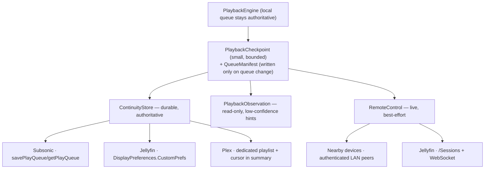

# ADR-0010 — Cross-device playback continuity (session handoff)

Status: **Proposed** (revised after source-level verification of all three backends).

## Context

The ask, from a r/selfhosted thread on what self-hosted music is missing versus
Spotify:

> if you're playing a track on one device and open Spotify on a second device, it
> will usually ask if you want to listen on the new device. If you say yes, it
> seamlessly ends the playback on the first device and starts it on the second
> one. […] You can switch the playback to any device you have connected to your
> account […] Basically, you can only have a single playback session going on in
> Spotify, and you can very easily move that session between devices.

Four capabilities, with very different requirements:

| # | Capability | Needs | Latency tolerance |
| --- | --- | --- | --- |
| C1 | "Continue here" — open on device B, resume where A was | durable state | seconds |
| C2 | Live progress mirroring | live channel | none |
| C3 | Device picker — push playback to another device | live channel + target awake | none |
| C4 | Single-session — A stops when B takes over | atomic ownership | seconds |

The maintainer's target scenario is explicitly **off-network**: listening on
cellular away from home, then coming home and booting a **PC**, which should know
what was playing. Pure-offline listening is out of scope until reconnect.

That scenario rules out iCloud (CloudKit / KV store / synced Keychain) for the
durable layer: it is Apple-device-only, so a PC can never read it, and the
entitlement cannot be provisioned headlessly — which would break the per-branch
headless deploy flow, exactly as App Groups did (see `AGENTS.local.md`). The
durable state must live on the user's own server.

### What Mozz already has

- `PlaybackEngine.persistentState` → `PlaybackPersistentState { queue: PlayQueue,
  elapsed }`, `Codable`, with `restore(_:)`.
- Playback already reported to every backend: Jellyfin `Sessions/Playing[/Progress
  |/Stopped]`, Plex `/:/timeline`, Subsonic `scrobble`.
- `ServerCapabilities` / `CapabilityResolver` — the established per-server gating
  pattern.
- `NSLocalNetworkUsageDescription` + `NSBonjourServices` already in `project.yml`;
  `LocalNetworkPermission` already handles the iOS permission race.
- `clientIdentifier` — already a stable, per-install, **device-local** id that each
  server uses to tell devices apart (`AppEnvironment.buildBackend` deliberately
  presents *this* device's, never the iCloud-synced session's).

## The decisive finding

An earlier draft of this ADR proposed a "universal floor": recover *what was
playing and where* from the play history every backend already records, needing no
client-writable storage. **Source-level verification killed it. No supported
server persists a resume position for music.**

| Server | Evidence | Position stored? |
| --- | --- | --- |
| **Jellyfin** | `Audio` does not override `SupportsPositionTicksResume`, so it inherits `BaseItem`'s `=> false`. `UserDataManager.UpdatePlayState` then runs `if (!item.SupportsPositionTicksResume) { positionTicks = 0; }` before writing. (`MediaBrowser.Controller/Entities/Audio/Audio.cs`, `Emby.Server.Implementations/Library/UserDataManager.cs`) | **No — always written as 0** |
| **Plex** | `viewOffset` is absent from `Track` records returned by `/status/sessions/history/all`; it appears only in *live* `/status/sessions`. "Store Track Progress" is widely reported broken for audio (`plexinc/plex-media-player#738`). | **No** |
| **Subsonic** | `scrobble` has no position parameter in the protocol. Mozz correspondingly sends only `submission=false` at position 0 and `submission=true` on stop (`SubsonicBackend.swift:346`). | **No** |

Two further defects sink the idea even for identifying the *track*:

- "Most recently played" identifies a **completed/scrobbled** track, which is not
  necessarily the track that was playing when playback stopped.
- The same server account is shared with every other client the user runs, so the
  most recent activity may not be Mozz's at all.

**Conclusion: Mozz must write its own checkpoint.** Play history is at best a
low-confidence hint, never a correctness primitive.

Related, equally decisive negative findings:

- **Jellyfin `NowPlayingQueue` is in-memory only** (a `ConcurrentDictionary` in
  `SessionManager`), lost on disconnect or server restart.
- **Plex play queues are ephemeral and client-scoped.** They are session-linked
  with no persistence guarantee, and `GET /playQueues/{id}` from a different
  `X-Plex-Client-Identifier` is not reliably a passive read (`own=1` *transfers
  ownership*). An earlier draft claimed Plex could offer full-queue durability via
  `/playQueues`; **that claim is withdrawn.**
- **A suspended iOS app cannot be a cast target.** iOS tears down the `NWListener`
  and its Bonjour advertisement at suspension, and there is no socket-wake for
  third-party apps. Spotify's own iOS app does not appear in Connect lists when
  closed. Waking a cold device would require APNs — which needs a provider server
  the user would have to run and pay for, violating the zero-cost constraint.

## Decision

Write our own checkpoint, keep it small, and be honest about what each server can
hold. Three narrow protocols rather than one document that every adapter pretends
to round-trip.



### 1. Data model

Split by write frequency, because the queue is large and static while the cursor
is small and constantly moving:

```swift
/// Small, written often.
public struct PlaybackCheckpoint: Codable, Sendable {
    public var serverFingerprint: String   // canonical, NOT derived from baseURL
    public var deviceID: String            // domain-separated hash of clientIdentifier
    public var deviceName: String
    public var capturedAt: Date
    public var state: PlaybackState        // playing / paused / stopped
    public var current: TrackLocator
    public var positionSeconds: TimeInterval
    public var manifestRevision: Int        // ties cursor to a QueueManifest
    public var indexInManifest: Int
}

/// Large, written only when the queue itself changes.
public struct QueueManifest: Codable, Sendable {
    public var revision: Int
    public var descriptor: QueueDescriptor  // source kind + id + shuffle seed/version
    public var window: [TrackLocator]       // bounded: current + ~20 back, ~100 ahead
    public var isWindowed: Bool             // true when the real queue was larger
}
```

`TrackLocator` is **server-qualified** (`serverFingerprint` + `remoteID`). A bare
`Track.id` is only meaningful within one server, and the database already keys on
`(serverId, remoteId)` for exactly this reason.

**Canonical server fingerprint.** Today `AppEnvironment.serverId` is
`"\(kind)-\(baseURL)"`. That silently breaks cross-device correlation: the *same*
server reached at `http://192.168.1.5:8096` on the LAN and
`https://music.example.com` remotely produces two different ids. The fingerprint
must come from the server's own identity — Plex `machineIdentifier`, Jellyfin
server `Id`, Subsonic `username@normalized-host` — not from the URL used to reach
it.

**Bounded window.** A 5,000-track shuffled queue is ~200 KB of ids and, on
Subsonic, is sent as repeated `id=` query parameters — which will exceed common
proxy/server URL limits long before the storage does. Store a window plus the
descriptor and re-derive the rest locally; declare oversized ad-hoc queues
explicitly windowed rather than claiming full fidelity.

**Shuffle.** `PlayQueue` keeps both the base `tracks` and the `order` permutation;
a flat id list plus an `isShuffled` flag cannot preserve both, so turning shuffle
off on the receiving device could not restore album order. The manifest therefore
carries the realized order plus a shuffle seed/version in the descriptor.

**Station queues cannot transfer.** `continueAsStation` holds a runtime closure
(`onQueueNearEnd`), which is not serializable. A station transfers as its
descriptor and resumes generation locally, or transfers as a plain queue.

### 2. Protocols

Deliberately **not** one protocol with capability flags — the adapters genuinely
differ in what they can hold, and a single `save(document)` would be a lie on
Subsonic (which stores only ids, current and position — no shuffle, repeat,
ownership or device).

| Protocol | Purpose | Availability |
| --- | --- | --- |
| `ContinuityStore` | Read/write Mozz's authoritative checkpoint | Per-backend; the only source of truth for C1 |
| `PlaybackObservation` | Read-only, low-confidence "what did this account play recently / what is live right now" | Everywhere, but never authoritative |
| `RemoteControl` | Live commands to another device | Nearby LAN peers; Jellyfin sessions |

Rich fields that a native store cannot hold are carried only where a free-form
store exists; elsewhere they degrade explicitly rather than silently.

### 3. Store adapters (evidence-based)

| Backend | Mechanism | Verified | Fidelity |
| --- | --- | --- | --- |
| **Subsonic** | `savePlayQueue` / `getPlayQueue` | Per-user, atomic replace, **no expiry, no size cap** (one row, ids as a comma-separated blob). `position` is **milliseconds**; `current` is a **track-id string**, not an index. Implemented by Navidrome, gonic and LMS. | ids + current + position |
| **Jellyfin** | JSON blob in `DisplayPreferences` `CustomPrefs` | `CustomItemDisplayPreferences.Value` has **no `MaxLength`** — unlimited TEXT. A non-GUID `displayPreferencesId` is deterministically MD5-hashed, so a stable string key works. `Client` is capped at 32 chars. | full checkpoint + manifest |
| **Plex** | **Open decision** — see below | No client-writable KV store exists; play queues are ephemeral | see below |

**Subsonic caveats, all verified:** `changedBy` is the `c=` query parameter — i.e.
the *client product name*, not a device, so two Mozz installs are
indistinguishable unless `c` is varied per device (Mozz currently sends a constant
`clientInfo.product`). LMS hardcodes `changedBy` to `""`. gonic returns error 10
for an empty-`id` save, so "clear the queue" must not be expressed that way.
Navidrome ≥ 0.57.0 prefers the `indexBasedQueue` extension
(`savePlayQueueByIndex`), which handles duplicate tracks correctly and shares the
same underlying row.

**The Subsonic payoff is real, not theoretical:** Feishin — the most popular
desktop Subsonic client — actively implements these endpoints behind its
`SERVER_PLAY_QUEUE` feature flag. A queue saved by Mozz on the phone is genuinely
loadable by Feishin on a PC. That *is* the maintainer's scenario, satisfied with
no Mozz-specific software on the PC at all.

### 4. Ownership: best-effort, explicitly not a guarantee

None of these substrates offers compare-and-swap, ETags or any fencing primitive,
so a monotonic `generation` counter **cannot** enforce single-session ownership:
two devices can read generation 5, both write 6, and a later periodic save from
the loser silently reinstates it. An offline device flushing a stale checkpoint
can physically destroy a newer one.

Therefore **C4 is downgraded to best-effort**, and the honest rules are:

- The old player is stopped only through a live, authenticated connection.
- Offline writes are an outbox **compacted to latest-value-only**, never an event
  backlog, and are discarded if a newer remote checkpoint is observed on reconnect.
- Never blind-flush: read before write, and drop our write if the remote checkpoint
  is newer than our capture time.
- `state` is paired with `capturedAt` and honoured only inside a short lease
  (~60 s). A crashed device otherwise leaves `playing` set forever. Position is
  extrapolated only within the lease, and the receiving device never autoplays.

This is not a weakening of the product promise so much as an admission of what the
platform already forced: a suspended iOS device cannot be stopped remotely at all.

### 5. Live layer: "nearby devices", authenticated

Scoped honestly to **devices currently running Mozz**:

- iOS advertises only while it is alive — i.e. while playing audio (background
  `audio` mode keeps `NWListener` up indefinitely) or foregrounded. On suspension
  the advertisement disappears and cannot be woken.
- macOS does not suspend, so a Mac running Mozz *is* a reliable always-on peer.
- `_mozz._tcp` must be added to `NSBonjourServices` for **advertising** as well as
  browsing; omitting it fails specifically on TestFlight/App Store builds.

**Security is mandatory, and was missing from the first draft.** Remotely
executable play/stop commands over the LAN require: minimal anonymous presence
until authenticated, one-time pairing with a code/QR-derived key, encrypted and
nonce-protected commands to prevent replay, and metadata revealed only after
pairing. Peers fetch the checkpoint on demand rather than broadcasting it.

The wire protocol must be **platform-neutral** (framed messages over TCP + mDNS),
because `NWConnection` is Apple-only and a future PC peer has to speak it.

### 6. Write cadence

Cursor: immediately on track change, seek, pause, stop and backgrounding; every
15–30 s while playing; coalesced and backed off on failure. Manifest: only on
actual queue mutation. Without periodic writes a crash mid-track resumes at the
track's start.

### 7. Module placement

`RepeatMode` lives in `MozzPlayback`, which already imports `MozzCore` — so
putting a model that references it *in* `MozzCore` would create a cycle. Portable
wire types go in a new **`MozzContinuity`** module depending only on `MozzCore`,
mapped to playback types at the boundary.

`deviceID` is a **domain-separated hash of the existing `clientIdentifier`** — not
a new identifier. It is already stable per install and device-local, and reusing it
lets a checkpoint correlate with server-side session data.

## Open decision — Plex durable storage

Plex has no client-writable key-value store and no durable queue. Two options:

1. **Dedicated playlist** (`Mozz — Continue Listening`) holding the queue, with the
   cursor JSON in the playlist's editable `summary`. Durable, account-scoped,
   cross-device. Costs: one visible playlist in the user's library, and playlist
   **writes** must be added — `MusicBackend` currently exposes only
   `fetchPlaylists` / `fetchPlaylistItems`, no create/update.
2. **Accept degraded Plex** — track-only, no position and no queue, recovered from
   `/status/sessions/history/all?sort=viewedAt:desc` as a low-confidence hint.

Option 1 is the only way Plex reaches parity. Option 2 ships sooner and touches
nothing. This needs a product call.

## Rejected alternatives

| Rejected | Why |
| --- | --- |
| CloudKit / iCloud KV / synced Keychain | Apple-only, so a PC can never read it — fails the target scenario; entitlement breaks headless deploy |
| Plex `/playQueues` as durable store | Verified ephemeral and client-scoped |
| Server play-history as a correctness primitive | No server stores a music position; "recently played" ≠ "was playing" |
| APNs push to wake a cold device | Requires a provider server the user must run and pay for |
| A user-hosted coordinator service with CAS/leases | The only way to get *strict* C4, but it is one more thing to self-host; the promise is reduced instead |
| Event log / CRDT | No substrate here offers atomic append or merge; a CRDT in a last-writer-wins slot still loses updates |

## Consequences

**Good.** Works on every backend; works off-LAN; readable by a non-Apple PC (and on
Subsonic, by existing PC clients with no extra software); no new entitlement, so
headless per-branch deploy keeps working; costs the user nothing; nothing leaves
their infrastructure.

**Costs.** Three store adapters with genuinely different fidelity, which the UI must
communicate honestly. A bounded window means very large ad-hoc queues do not
transfer verbatim. Single-session is best-effort, not guaranteed. The LAN layer
needs a pairing/crypto design and a portable wire protocol. Plex needs a product
decision. Playlist writes may need adding to the backend protocol.

## Phasing

| Phase | Delivers | Capabilities |
| --- | --- | --- |
| 1 | `MozzContinuity` models + `ContinuityStore` + Subsonic adapter + "Continue here" | C1 on Subsonic |
| 2 | Jellyfin `CustomPrefs` adapter | C1 on Jellyfin |
| 3 | Plex (per the open decision) | C1 on Plex |
| 4 | Authenticated nearby-device layer: live mirroring + picker | C2, C3, best-effort C4 |
| 5 | Jellyfin `/Sessions` + WebSocket for off-LAN live control | C2, C3 off-LAN |
