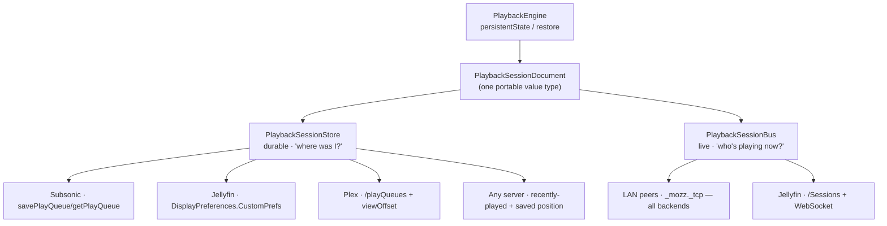

# ADR-0010 — Cross-device playback continuity (session handoff)

Status: **Proposed**.

## Context

The request, in the words of a r/selfhosted commenter describing what self-hosted
music is missing versus Spotify:

> if you're playing a track on one device and open Spotify on a second device, it
> will usually ask if you want to listen on the new device. If you say yes, it
> seamlessly ends the playback on the first device and starts it on the second
> one. If you continue on the original device, you see the track progress in
> real-time on device two. You can switch the playback to any device you have
> connected to your account […] Basically, you can only have a single playback
> session going on in Spotify, and you can very easily move that session between
> devices.

Decomposed, that is four separate capabilities with very different requirements:

| # | Capability | Needs | Tolerates latency? |
| --- | --- | --- | --- |
| C1 | "Continue here" — open on device B, resume where device A was | durable state | yes (seconds) |
| C2 | Live progress mirroring — B watches A's position tick | live channel | no |
| C3 | Device picker — push playback to another device | live channel + target awake | no |
| C4 | Single-session semantics — A stops when B takes over | conflict resolution | yes |

The target scenario Brandon named is explicitly **off-network**: listening on
cellular away from home, then coming home and booting a PC, which should know
what was playing. That single sentence rules out several otherwise-attractive
designs, because the state must be readable by a machine that is **not** an Apple
device and was **not** on the LAN when the listening happened.

### What Mozz already has

- `PlaybackEngine.persistentState` → `PlaybackPersistentState { queue: PlayQueue,
  elapsed: TimeInterval }`, `Codable`, with a matching `restore(_:)`. This is
  already the exact handoff payload.
- Playback is already reported to every backend: Jellyfin
  `Sessions/Playing[/Progress|/Stopped]`, Plex `/:/timeline`, Subsonic
  `scrobble`. **Every supported server therefore already knows what Mozz played
  and when.**
- `ServerCapabilities` + `CapabilityResolver` — the established pattern for
  gating features on per-server probing rather than branching on `BackendKind`.
- `NSLocalNetworkUsageDescription` and `NSBonjourServices` are already declared in
  `project.yml`; `LocalNetworkPermission` already handles the iOS local-network
  permission race.

### The constraint that shapes everything: no single API covers all servers

| Backend | Purpose-built queue API? | Finding |
| --- | --- | --- |
| **Subsonic / Navidrome** | **Yes** — `savePlayQueue` / `getPlayQueue` | Server-persisted queue + `current` + `position`, and `getPlayQueue` returns `changed` / `changedBy` (the device that last wrote). Effectively this exact feature, standardised since Subsonic 1.12.0. Navidrome implements it; ids are **strings**, not the spec's ints. |
| **Jellyfin** | **No** | `NowPlayingQueue` lives on the *session* and is **not** persisted once the client disconnects. Per-item position **is** persisted (`UserData.PlaybackPositionTicks`). A queue must therefore be stored by the client, in the per-user client-writable KV store `DisplayPreferences.CustomPrefs`. |
| **Plex** | **Partial** | `/playQueues` creates a genuinely server-side queue object with a `playQueueID` that another device can `GET`; `viewOffset` rides `/:/timeline`. But nothing tells device B *which* `playQueueID` was device A's — there is no per-client KV store to leave the pointer in. |

So the naive designs both fail:

- **"Use the server's session API"** — only Jellyfin has a real one, and its queue
  does not survive disconnection.
- **"Use iCloud (CloudKit / KV store / synced Keychain)"** — fails the stated PC
  scenario outright (Apple devices only), adds a third-party dependency to a
  self-hosted app, and CloudKit/KVS need an entitlement that cannot be provisioned
  headlessly (see `AGENTS.local.md`: the App Groups precedent), which would break
  the per-branch headless deploy flow.

## Decision

Split the feature along the durability/liveness seam, because that is where the
per-server differences actually fall. Two small protocols in `MozzCore`, each with
pluggable adapters, and a **fidelity ladder** so every server gets the best
behaviour its API can support and no server gets nothing.



### 1. One portable document

```swift
public struct PlaybackSessionDocument: Codable, Sendable, Hashable {
    public var generation: Int          // monotonic; the conflict resolver
    public var deviceID: String         // stable per install (NOT the shared clientIdentifier)
    public var deviceName: String       // "Brandon's iPhone"
    public var deviceKind: DeviceKind   // phone / tablet / desktop / web / speaker
    public var updatedAt: Date
    public var isPlaying: Bool
    public var trackIDs: [String]       // provider remote ids, queue order
    public var currentIndex: Int
    public var positionSeconds: TimeInterval
    public var source: QueueSource?     // album/playlist/station id — lets a peer re-derive a queue it can't read verbatim
    public var isShuffled: Bool
    public var repeatMode: RepeatMode
}
```

`source` matters: when a store can only carry a track and a position (the bottom
rung), the receiving device can still rebuild a *sensible* queue from its own
local catalog rather than playing an orphaned single track.

### 2. Durable state — `PlaybackSessionStore`

```swift
public protocol PlaybackSessionStore: Sendable {
    var fidelity: SessionFidelity { get }        // .fullQueue | .trackAndPosition | .none
    func save(_ doc: PlaybackSessionDocument) async throws
    func load() async throws -> PlaybackSessionDocument?
}
```

Adapters, best-first:

| Adapter | Mechanism | Fidelity | Other clients benefit? |
| --- | --- | --- | --- |
| Subsonic | `savePlayQueue` / `getPlayQueue` | full queue | **Yes** — any Subsonic client (Feishin, Supersonic, symfonium) picks up Mozz's queue for free, on any OS |
| Jellyfin | queue JSON in `DisplayPreferences.CustomPrefs`; position also lands natively in `UserData` | full queue | position yes, queue Mozz-only |
| Plex | `/playQueues` object + `viewOffset`; `playQueueID` carried in the document | full queue | partial |
| **Universal floor** | "most recently played track + its saved position", derived from play history every backend already records (`lastViewedAt` desc / `DatePlayed` desc / now-playing) | track + position | inherent |

The universal floor is the load-bearing piece of this ADR. It needs **no
client-writable storage on the server at all** — only the play reports Mozz
*already* sends. It therefore works on a server we have never heard of, and it
alone satisfies the stated scenario ("it should know what song I was listening
to"). Everything above it is an upgrade in fidelity, not a precondition.

### 3. Live state — `PlaybackSessionBus`

```swift
public protocol PlaybackSessionBus: Sendable {
    func advertise(_ doc: PlaybackSessionDocument) async
    func peers() -> AsyncStream<[RemoteDevice]>
    func send(_ command: RemoteCommand, to peer: RemoteDevice) async throws
}
```

| Transport | Reach | Backends | Delivers |
| --- | --- | --- | --- |
| **LAN peers** — `_mozz._tcp` Bonjour advertise/browse + `NWConnection` | same network | **all** | C2 + C3 with no server support whatsoever; covers "moving around the house", the scenario the Reddit comment calls out as *"really nice"* |
| **Jellyfin** `/Sessions` + WebSocket (`POST /Sessions/{id}/Playing/{command}`) | anywhere the server is reachable | Jellyfin | C2 + C3 off-LAN, and interop with the Jellyfin web player / Findroid |
| **Plex Companion** | anywhere | Plex | deferred — GDM/plex.tv `provides=player` registration is disproportionately fiddly |

Putting the *universal* real-time layer on the LAN rather than on the server is
deliberate: it is the only real-time transport that works identically for Plex,
Jellyfin, Subsonic and any future backend, and it needs no entitlement.

### 4. Single-session semantics (C4)

`generation` is monotonic; ties break on `(updatedAt, deviceID)`. Taking over =
load, `generation += 1`, set `deviceID` to self, save. If a live bus can reach the
previous owner it is also sent an explicit `.stop`; if it cannot, the old owner
notices it has been superseded on its next periodic save/load and stops itself.

This is what makes takeover **universal**: correctness comes from the durable
document, and the live channel is only a latency optimisation. A device that is
asleep, off-LAN, or on a server with no session API still yields the session
correctly — it just yields it a little later.

### 5. Offline listening

Writes go through an outbox and flush on reconnect, so a purely-offline listening
session still lands on the server once there is a network. Until then, other
devices legitimately do not know about it — the one case Brandon explicitly
excluded.

## Consequences

**Good**

- Works on **every** backend, including ones with no session API, via the floor.
- Works **off-LAN** and is readable by a **non-Apple PC**, because the state lives
  on the user's own server — the stated scenario.
- **No new entitlement**, so the headless per-branch deploy keeps working.
- Nothing leaves the user's infrastructure; no Apple or third-party dependency.
- On Subsonic it is bidirectionally interoperable with *other* clients for free.
- Each layer is independently useful and independently shippable.

**Costs**

- Four store adapters instead of one; per-backend fidelity differences must be
  surfaced honestly in the UI ("queue" vs "just the track").
- A LAN peer channel is new surface area (Bonjour + `NWConnection` + a small
  framed protocol) and needs `_mozz._tcp` added to `NSBonjourServices`.
- `deviceID` must be a **new per-install identifier**, deliberately *not* the
  existing `clientIdentifier` — that one is device-local precisely because two
  devices sharing it register as one device on the server
  (`RoutingCredentialStore`), which is the same reason it cannot identify a peer.

## Open questions (verify against live servers before implementing)

1. `DisplayPreferences.CustomPrefs` value size limit on Jellyfin — caps how long a
   stored queue can be; a cap plus `source` re-derivation is the fallback.
2. Whether Jellyfin persists `PlaybackPositionTicks` for **audio** items at all
   resume thresholds, or only past a minimum duration.
3. Plex: confirm a non-owner token can `GET /playQueues/{id}` created by the same
   account on another device.
4. Subsonic: confirm `changed`/`changedBy` are populated by Navidrome, and confirm
   the string-id handling noted above.
5. Whether any server rate-limits the save cadence; pick a debounce (target: on
   track change, pause, seek, and background — not every progress tick).

## Phasing

| Phase | Delivers | Capabilities |
| --- | --- | --- |
| 1 | `PlaybackSessionDocument` + `PlaybackSessionStore` + universal floor adapter + "Continue here" banner | C1, C4 |
| 2 | Native store adapters (Subsonic → Jellyfin → Plex) | C1 at full fidelity |
| 3 | LAN peer bus: live progress + device picker | C2, C3 |
| 4 | Jellyfin `/Sessions` + WebSocket for off-LAN live control | C2, C3 off-LAN |
