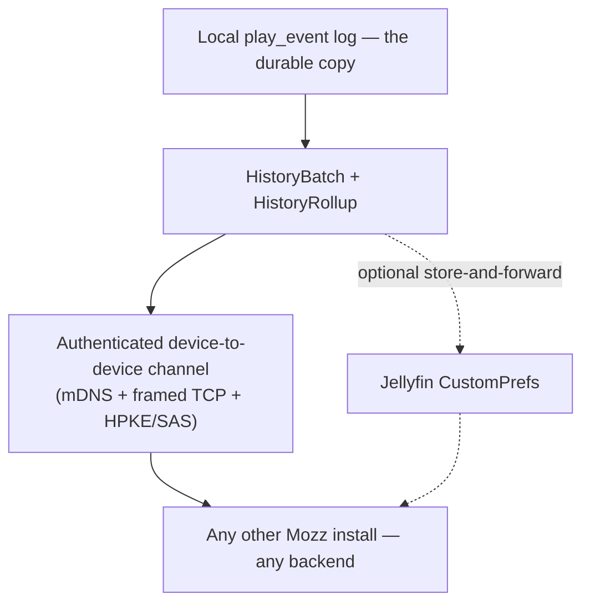

# ADR-0011 — Listening history syncs device to device, not through the server

Status: **Proposed**

Supersedes the transport half of the history work landed in `MozzHistory` /
`JellyfinHistoryStore`; the data model, merge semantics and `spec/history`
contract are unaffected.

## Context

Mozz keeps an append-only log of listening events. Every backend records a
*scrobble* — a completed play — but **none of them record a skip, and none
record a partial listen**. `TasteProfile` weights those heavily and in opposite
directions (completed +1.0, skipped −0.6), so the signal that personalizes Mozz
exists nowhere but the local `play_event` log. An hour listened on a second
device is not merely unsynced; it is gone, and the two devices' recommendations
drift apart permanently.

The first implementation put history in Jellyfin's per-user
`DisplayPreferences.CustomPrefs`, the same substrate ADR-0010 uses for
continuity. That works, and it works only for Jellyfin.

**The requirement this ADR answers is a hard project rule: a feature is
supported on every backend or it is not shipped.** Mozz's promise is "one app
for your music, wherever it lives"; a taste profile that silently degrades on
Plex is that promise broken for a third of users.

## Findings

### There is no universal client-writable store

Verified per backend, not assumed:

| Backend | Candidate | Verdict |
| --- | --- | --- |
| **Jellyfin** | `DisplayPreferences.CustomPrefs` | ✅ Genuine per-user KV, `Value` is unlimited TEXT |
| **Subsonic** | `savePlayQueue` | ❌ A queue of track ids and a position — it cannot carry arbitrary data at all |
| **Subsonic** | Playlist `comment` | ⚠️ Arbitrary text, but ~1 KB before client/server compatibility degrades — two orders of magnitude short |
| **Subsonic** | Bookmarks (`createBookmark`, arbitrary `comment`) | ⚠️ Keyed to a real track id, and surface in every other client as phantom resume markers on tracks the user never paused |
| **Plex** | any client-writable KV | ❌ **None exists.** ADR-0010 verified `/playQueues` is ephemeral and client-scoped; `/:/prefs` is server-admin |
| **Plex** | Playlist `summary` | ⚠️ Arbitrary text, but a *regular* playlist cannot even be created empty — it needs a dummy track or a smart-playlist rule |

So a server-mediated design cannot be universal. It would need three
implementations, two of which are abuses of fields meant for human-authored
text, and the Plex one cannot be built at all without inventing a playlist in
the user's library.

### The playlist-description trick is rejected outright

It was the obvious way to reach "all backends", and it is a hack in the precise
sense: it stores application state in a field whose purpose is something else,
and every consequence follows from that mismatch.

- **It is user-visible clutter**, one artifact per device per server, in a
  library the user curates. ADR-0010 already reached this conclusion for
  continuity and made the Plex playlist adapter opt-in for exactly this reason.
- **It is user-deletable.** A playlist looks like a mistake and invites tidying,
  and deleting it silently destroys history.
- **It does not fit.** ~1 KB of safe Subsonic comment against a batch budget
  measured in hundreds of kilobytes is not a tuning problem.
- **Plex cannot create an empty one**, so the workaround needs its own
  workaround.

Any one of these is disqualifying. Together they say the field is not a store.

### History is Mozz's data, and the server was never its home

The deeper point the failed survey exposes: **a scrobble is the server's record;
a skip is Mozz's observation.** Servers have no schema for it because it is not
theirs. Jellyfin's `CustomPrefs` felt natural only because it happened to be a
convenient dictionary — it is still Mozz's private data parked in another
application's preferences.

### What continuity needs and history needs are not the same

ADR-0010 rejected a device-to-device-only design for continuity because a resume
point is worthless if it arrives late, and **a suspended iOS app cannot be
reached**: iOS tears down `NWListener` and its Bonjour advertisement at
suspension, so a phone in a pocket is unreachable.

History does not have that constraint, and this is the observation that decides
this ADR:

> A play recorded an hour late — or a day late — lands in exactly the same taste
> profile and exactly the same month of the same year.

History is **latency-tolerant**. It only needs the two devices to be awake
together *eventually*, which for a phone and a desktop on one home network is a
daily occurrence. Continuity could not accept that; history can, without any loss
of correctness.

The merge is already designed for it: events are immutable and only ever added,
so the union is a G-Set — order-independent, idempotent, and needing no
compare-and-swap (see `spec/history`). Nothing about arriving late can corrupt
it.

## Decision

**Listening history syncs device to device over the authenticated local channel,
and does not use per-server storage as its mechanism.**

1. **The transport is backend-agnostic by construction.** It exchanges
   `HistoryBatch` and `HistoryRollup` values between two paired Mozz installs.
   It never touches the music server, so Plex, Jellyfin, Subsonic and anything
   added later behave identically. There is no tier and no degraded mode.
2. **It reuses the pairing channel**, not a second one. ADR-0010 §8 already
   requires an authenticated nearby-device layer — mDNS discovery, framed
   messages over TCP, HPKE (RFC 9180) with a commit/reveal SAS ceremony — gated
   on a security ADR. History becomes the first payload carried over it rather
   than a reason to invent another.
3. **The wire format stays platform-neutral**, per the same section: a Windows or
   Android peer must speak it, so it is specified in `spec/`, not in Swift.
4. **`JellyfinHistoryStore` is demoted, not deleted.** It stops being *the*
   mechanism and becomes an optional **store-and-forward relay**: where a server
   genuinely offers a KV store, a device may leave a batch there so peers can
   collect it without both being awake at once. This is an availability
   optimization on top of a feature that already works everywhere — not a
   capability some users get and others do not.

### What this costs, stated plainly

- **Both devices must be awake together, eventually.** On iOS that means Mozz in
  the foreground or playing audio. For a phone and a desktop at home this is
  routine; for someone who never opens two devices near each other, history stays
  local until they do. That is the price of not abusing anyone's API, and it
  degrades gracefully — nothing is lost, only delayed, because the local log is
  the durable copy.
- **The security work is now on the critical path.** Nothing ships until the
  pairing ADR exists. That is the correct order: it is also what unlocks
  credential transfer and the wider cross-platform plan, so it is not
  history-specific cost.
- **Jellyfin users keep an advantage** (asynchronous relay). Called out honestly
  rather than hidden, and it never leaves another backend without the feature.

## Alternatives rejected

| Rejected | Why |
| --- | --- |
| Per-server storage as the mechanism | No universal client-writable store exists; Plex has none at all |
| Playlist `comment`/`summary` as a KV | User-visible, user-deletable, ~1 KB on Subsonic, and Plex cannot create an empty playlist |
| Subsonic bookmarks | Keyed to real tracks; surfaces phantom resume markers in every other client |
| A Mozz-hosted relay / account | Contradicts the zero-account position; a permanent bill and a breach surface for data that never needed to leave the user's devices |
| Ship Jellyfin-only, extend later | The project rule this ADR exists to satisfy. It would also entrench a data model shaped by one server's dictionary |
| Extend `MusicBackend` with playlist writes | ADR-0010 already rejected this; playlists are read-only there deliberately |

## Consequences

**Good.** Every backend gets identical behaviour, including Plex, which has no
server-side option whatsoever. Nothing is written to the user's library. Mozz's
private observations stay on the user's own devices. The transport is the one a
Windows and Android client will need anyway, so this work is not iOS-specific.
No account, no first-party server, no cost.

**Bad.** History does not move while only one device is awake — an asynchrony
that continuity could not have tolerated, and that this feature can. Jellyfin
users get better availability than others, which must be described accurately in
the UI rather than papered over.

## Status of existing work

Unaffected: `MozzHistory` (models, G-Set merge, windowing, rollups),
`HistorySyncStore`, `HistoryRollupBuilder`, `spec/history`, and every test
covering them. They were written transport-agnostically behind the
`HistoryStore` protocol, which is exactly the seam this decision needs.

Changed: `JellyfinHistoryStore` is reframed as an optional relay, and
`HistoryCoordinator` must stop treating "no store" as "no sync" once the peer
channel exists.

Blocked on: the pairing/security ADR (ADR-0010 §8).
